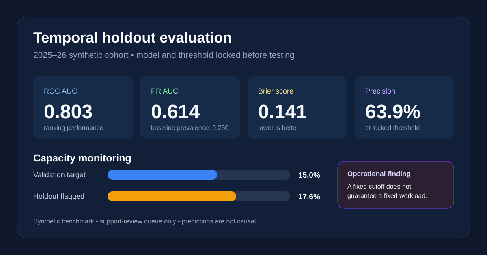
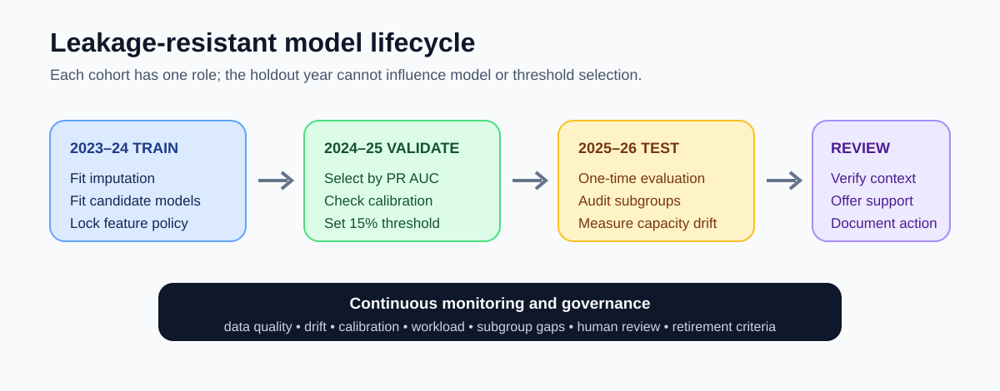

# Student Success Predictive Modeling

[](https://github.com/mjeans/student-success-predictive-modeling/actions/workflows/validate.yml)

An end-to-end R case study for identifying students who may benefit from proactive attendance support. The project emphasizes the parts of predictive analytics that matter after model fitting: temporal validation, probability quality, operational capacity, subgroup diagnostics, reproducible scoring, and responsible-use boundaries.

> All records are deterministic and synthetic. No student, school, district, or client data are included.



## Decision context

A student-success team can review approximately 15% of students for additional support after the first 30 instructional days. The analysis asks:

1. Can early-year engagement and attendance indicators help prioritize those reviews?
2. Does the model retain useful discrimination and probability accuracy in a later academic year?
3. How does a fixed validation-year threshold behave when prevalence shifts?
4. Are error patterns and review rates materially different across student groups?

The output is a **support-review queue**, not an automated decision. Staff must verify context before outreach, and scores must never be used for discipline, eligibility denial, or causal claims.

## Reference results

The deterministic benchmark compares logistic regression with a constrained decision tree. Logistic regression is selected on the 2024–25 validation cohort using PR AUC first and Brier score second. The final model is evaluated once on the untouched 2025–26 cohort.

| Holdout measure | Result | Interpretation |
|---|---:|---|
| Chronic-absence prevalence | 25.0% | Higher than the 20.5% validation cohort |
| ROC AUC | 0.803 | Useful ranking performance on the later cohort |
| PR AUC | 0.614 | Material lift over the 25.0% prevalence baseline |
| Brier score | 0.141 | Probability error remains informative but not negligible |
| Validation threshold | 0.421 | Selected to match 15% review capacity in validation |
| Holdout flagged rate | 17.6% | Capacity drift requires monitoring or threshold refresh |
| Sensitivity | 45.0% | The queue captures fewer than half of positive outcomes |
| Precision | 63.9% | About two in three flagged students experience the outcome |

These figures are predictive, not causal. They describe a synthetic benchmark and do not establish that any intervention changes attendance.

## What this project demonstrates

- Deterministic synthetic data generation with realistic missingness and cohort drift
- A leakage-resistant feature window limited to information available after 30 days
- Train/validation/test splits based on academic year rather than random rows
- Median imputation learned from training data only, with missingness indicators
- Logistic regression and decision-tree candidate models using base/recommended R packages
- Model selection based on PR AUC and Brier score rather than accuracy alone
- Capacity-aware threshold selection and sensitivity analysis
- Calibration intercept, calibration slope, expected calibration error, and Brier score
- Subgroup monitoring with minimum-cell suppression
- Protected characteristics retained for auditing but excluded from prediction
- A reusable scoring script, model bundle, tests, and GitHub Actions workflow

## Analytical workflow



The three academic years have distinct roles:

- **2023–24:** fit preprocessing and candidate models
- **2024–25:** select the model and a 15%-capacity threshold
- **2025–26:** estimate final performance and subgroup behavior

This prevents the holdout cohort from influencing model or threshold selection.

## Repository map

```text
R/            Data generation, preprocessing, metrics, models, and reporting
scripts/      Reproducible data, training, evaluation, and scoring entry points
config/       Modeling and operational assumptions
tests/        Determinism, leakage, range, split, and scoring checks
docs/         Model card, data dictionary, and decision memo
assets/       Portfolio-ready evaluation and lifecycle visuals
outputs/      Documentation for runtime-generated evaluation files
.github/      Continuous-integration workflow
```

## Reproduce the analysis

R and the recommended `rpart` package are the only requirements.

```bash
make all
```

Or run each stage directly:

```bash
Rscript scripts/01_generate_data.R
Rscript scripts/02_train_models.R
Rscript scripts/03_evaluate_models.R
Rscript scripts/04_score_new_cohort.R
Rscript tests/test_pipeline.R
```

Runtime data, fitted artifacts, and scored records are intentionally ignored by Git. The full workflow regenerates them deterministically, and continuous integration verifies the pipeline on every pull request.

## Responsible-use boundary

The model intentionally does not use gender, race/ethnicity, economic-disadvantage status, multilingual-learner status, or disability status as predictors. Those fields are used only for audit tables. Excluding them does not guarantee fairness because included measures can reflect structural inequities. The synthetic benchmark therefore treats subgroup differences as a signal for investigation, resource planning, and human review—not as justification for withholding support.

See the [model card](docs/model-card.md) for intended use and limitations, the [decision memo](docs/decision-memo.md) for operational recommendations, and the [data dictionary](docs/data-dictionary.md) for field definitions.

Built as a public portfolio demonstration by [Matthew Jeans, PhD](https://github.com/mjeans).
