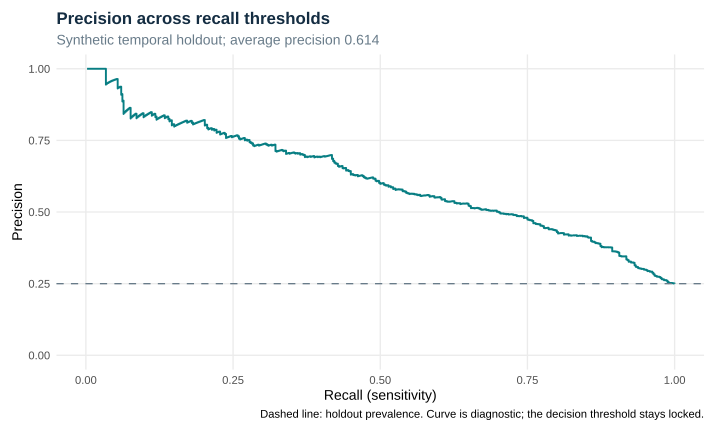
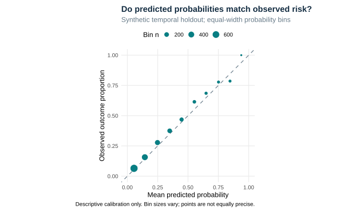

# Executed predictive-model evaluation

## Question and design

Can early attendance and service indicators prioritize supportive review on a later synthetic school-year cohort? Training, validation, and holdout years are separate; preprocessing is learned from training only. Protected attributes remain audit-only.

The validation-selected model is logistic_regression; threshold 0.4209 is locked before holdout evaluation (n = 2000).

## Validation model comparison

| model | prevalence | roc_auc | average_precision | brier_score | log_loss | calibration_intercept | calibration_slope | threshold | flagged_rate | sensitivity | specificity | precision | expected_calibration_error |
| --- | --- | --- | --- | --- | --- | --- | --- | --- | --- | --- | --- | --- | --- |
| logistic_regression | 0.204 | 0.813 | 0.571 | 0.124 | 0.394 | -0.109 | 0.988 | 0.421 | 0.150 | 0.433 | 0.923 | 0.590 | 0.015 |
| decision_tree | 0.204 | 0.691 | 0.403 | 0.137 | 0.441 | -0.172 | 0.908 | 0.385 | 0.198 | 0.489 | 0.876 | 0.504 | 0.008 |

Average precision groups tied scores at the threshold level. It is not trapezoidal PR area. The September 2026 correction removes order dependence; logistic regression remains selected.

## Holdout results

| model | split | prevalence | roc_auc | average_precision | brier_score | log_loss | calibration_intercept | calibration_slope | threshold | flagged_rate | sensitivity | specificity | precision | expected_calibration_error |
| --- | --- | --- | --- | --- | --- | --- | --- | --- | --- | --- | --- | --- | --- | --- |
| logistic_regression | 2025-26 temporal holdout | 0.25 | 0.803 | 0.614 | 0.141 | 0.443 | 0.094 | 0.965 | 0.421 | 0.176 | 0.45 | 0.915 | 0.639 | 0.02 |

[Threshold-level PR data](precision_recall_curve.csv) and [calibration bin denominators](calibration_bins.csv). The threshold-analysis CSV is exploratory holdout capacity monitoring, not a basis for retuning the locked model.

## Subgroup uncertainty and denominators

| group_variable | group | n | schools | positives | flagged | sensitivity | sensitivity_lower | sensitivity_upper | precision | precision_lower | precision_upper |
| --- | --- | --- | --- | --- | --- | --- | --- | --- | --- | --- | --- |
| gender | Female | 996 | 30 | 272 | 183 | 0.449 | 0.387 | 0.508 | 0.667 | 0.606 | 0.734 |
| gender | Male | 959 | 30 | 224 | 164 | 0.455 | 0.373 | 0.534 | 0.622 | 0.540 | 0.697 |
| gender | Nonbinary | 45 | 23 | Not reported | Not reported | Not reported | Not reported | Not reported | Not reported | Not reported | Not reported |
| race_ethnicity | Black | 403 | 30 | 91 | 65 | 0.473 | 0.375 | 0.571 | 0.662 | 0.566 | 0.764 |
| race_ethnicity | White | 401 | 30 | 111 | 76 | 0.468 | 0.363 | 0.583 | 0.684 | 0.569 | 0.783 |
| race_ethnicity | Asian | 371 | 30 | 103 | 67 | 0.427 | 0.327 | 0.519 | 0.657 | 0.556 | 0.746 |
| race_ethnicity | Multiracial | 421 | 30 | 103 | 73 | 0.437 | 0.356 | 0.510 | 0.616 | 0.528 | 0.724 |
| race_ethnicity | Hispanic | 404 | 30 | 92 | 71 | 0.446 | 0.351 | 0.550 | 0.577 | 0.459 | 0.695 |
| economically_disadvantaged | 0 | 1106 | 30 | 147 | 58 | 0.197 | 0.141 | 0.261 | 0.500 | 0.360 | 0.640 |
| economically_disadvantaged | 1 | 894 | 30 | 353 | 294 | 0.555 | 0.495 | 0.610 | 0.667 | 0.603 | 0.723 |
| multilingual_learner | 0 | 1562 | 30 | 396 | 276 | 0.455 | 0.402 | 0.505 | 0.652 | 0.591 | 0.702 |
| multilingual_learner | 1 | 438 | 30 | 104 | 76 | 0.433 | 0.341 | 0.536 | 0.592 | 0.487 | 0.696 |
| disability_status | 0 | 1721 | 30 | 401 | 269 | 0.419 | 0.368 | 0.470 | 0.625 | 0.558 | 0.683 |
| disability_status | 1 | 279 | 30 | 99 | 83 | 0.576 | 0.485 | 0.668 | 0.687 | 0.600 | 0.768 |

Intervals are 2.5th/97.5th percentiles from 500 school-cluster bootstrap replicates (seed 20260917), holding predictions and the model fixed. They account for resampling schools in this synthetic holdout, not training/model-selection uncertainty. Metrics are suppressed below 100 records; sensitivity additionally requires 20 positive outcomes and precision 20 flagged records. These are descriptive audits, not adjusted tests of group disparities or fairness certification.

## Operational boundary

The validation capacity target is 15%; the locked cutoff flags 17.6% of the holdout. A fixed cutoff does not guarantee a fixed workload.

Synthetic performance does not establish transportability or benefit. No automated eligibility, discipline, or denial decisions are authorized; a real deployment requires governance, external validation, and monitored human review.

## Reproduction

This report and its figures are generated by the repository scripts from deterministic synthetic data.
See the repository README for commands and the versioned environment.

[Runtime session and package versions](session-info.txt)
